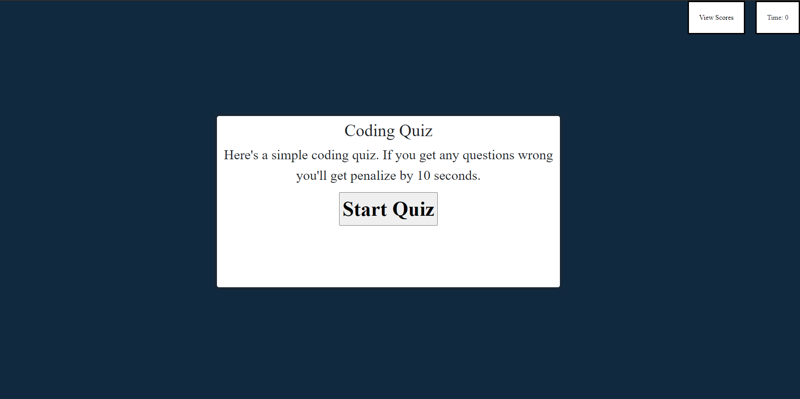

# Coding_Quiz

This is a coding quiz game where the questions are multiple choice. It starts off on the main page with a brief info, start button and view the high scores list, and when the game begins they must answer all the questions within the time limit, which changes dynamically based on how many questions are in the set. Questions answered incorrectly will give you a time penalty.

When the last question is answered, or when time runs out, the player will be taken to a submission page where they can enter their initials. The score and user input is then saved locally, then it brings you to the highscore board to view the data that just been entered. The player can choose to clear the high scores list from this page or go back and try again.

Here is a screen shot of the quiz

